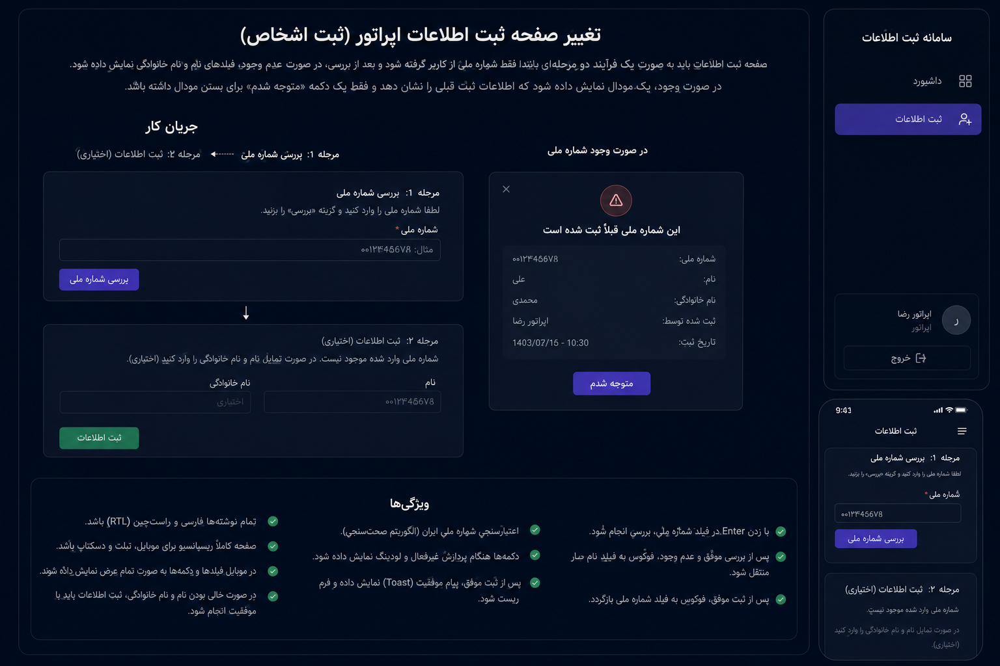

# Registration Management System

A production-ready registration management system built with Next.js 15, Prisma, SQLite, and TypeScript.





## Features

- Role-based authentication (Admin / Operator)
- Secure registration with Iranian National ID validation (checksum)
- Duplicate detection with operator attribution
- Admin panel: full operator CRUD, enable/disable, password reset
- Dashboard with per-operator statistics
- Search by national ID, first name, last name
- Excel export for admin
- Force password change on first login
- Rate limiting on login attempts
- CSRF protection, XSS prevention
- Dark mode responsive UI with loading indicators, toast notifications, confirmation dialogs

## Quick Start

```bash
# Clone and install
npm install

# Generate Prisma client
npx prisma generate

# Run database migration
npx prisma migrate dev

# Seed admin user
curl -X POST http://localhost:3000/api/seed

# Start development server
npm run dev
```

Navigate to http://localhost:3000.

## Default Admin Credentials

- **Username:** admin
- **Password:** admin123

You will be prompted to change your password on first login.

## Environment Variables

| Variable | Default | Description |
|---|---|---|
| `DATABASE_URL` | `file:./prisma/dev.db` | SQLite database file path |
| `NEXTAUTH_URL` | `http://localhost:3000` | Application base URL |
| `NEXTAUTH_SECRET` | `dev-secret` | JWT encryption secret (change in production) |
| `AUTH_DEBUG` | `false` | Enable auth debug logging |
| `NODE_ENV` | `development` | Environment mode |

## Scripts

| Command | Description |
|---|---|
| `npm run dev` | Start development server |
| `npm run build` | Build for production |
| `npm start` | Start production server |
| `npm test` | Run tests with coverage |
| `npm run lint` | Run ESLint |
| `npm run prisma:generate` | Regenerate Prisma client |
| `npm run prisma:migrate` | Run Prisma migrations |

## Project Structure

```
src/
├── app/                    # Next.js App Router pages and API routes
│   ├── (auth)/login/       # Login page
│   ├── admin/              # Admin panel (operator CRUD)
│   ├── api/                # API routes
│   │   ├── auth/           # NextAuth, change-password
│   │   ├── export/         # Excel export
│   │   ├── health/         # Health check
│   │   ├── registrations/  # Registration CRUD + search
│   │   ├── seed/           # Admin seed
│   │   └── users/          # User management
│   ├── dashboard/          # Dashboard page
│   ├── force-password-change/ # Password change page
│   ├── operator/           # Operator panel
│   └── registrations/      # Registration form + list
├── components/             # Reusable React components
│   ├── AdminPanel.tsx      # Admin CRUD panel
│   ├── AppShell.tsx        # Layout shell with sidebar
│   ├── ConfirmDialog.tsx   # Confirmation modal
│   └── RegistrationForm.tsx # Registration form with duplicate detection
├── lib/                    # Core libraries
│   ├── auth.ts             # NextAuth configuration
│   ├── prisma.ts           # Prisma singleton
│   └── rate-limit.ts       # Login rate limiter
├── middleware.ts           # Auth + role middleware
├── repositories/           # Data access layer
├── services/               # Business logic layer
├── types/                  # TypeScript type definitions
├── utils/                  # Utility functions (CSRF, etc.)
└── validation/             # Zod validation schemas
```

## API Routes

| Method | Route | Auth | Description |
|---|---|---|---|
| POST | `/api/auth/[...nextauth]` | — | NextAuth handlers |
| POST | `/api/auth/change-password` | Auth | Change password |
| GET | `/api/health` | — | Health check |
| POST | `/api/seed` | — | Seed admin user |
| GET | `/api/export` | Admin | Export Excel |
| GET/POST | `/api/registrations` | Auth | List/create registrations |
| GET | `/api/registrations/search` | Auth | Search registrations |
| GET | `/api/users` | Admin | List users |
| POST | `/api/users` | Admin | Create user |
| PATCH | `/api/users/[id]` | Admin | Update user |
| DELETE | `/api/users/[id]` | Admin | Delete user |

## Running with Docker

```bash
docker compose up
```

## Running Tests

```bash
# All tests with coverage
npm test

# Run specific test file
npx vitest run src/services/registration-service.test.ts

# Watch mode
npx vitest
```

## Database

### Backup SQLite Database

```bash
cp prisma/dev.db prisma/dev.db.bak
```

### Restore Database

```bash
cp prisma/dev.db.bak prisma/dev.db
```

### Reset Database

```bash
rm prisma/dev.db
npx prisma migrate dev
curl -X POST http://localhost:3000/api/seed
```

### View Data with Prisma Studio

```bash
npx prisma studio
```

## Production Deployment

```bash
npm run build
npm start
```

For production:
1. Set a strong `NEXTAUTH_SECRET`
2. Set `NODE_ENV=production`
3. Ensure `DATABASE_URL` points to the correct path
4. Disable `AUTH_DEBUG`
